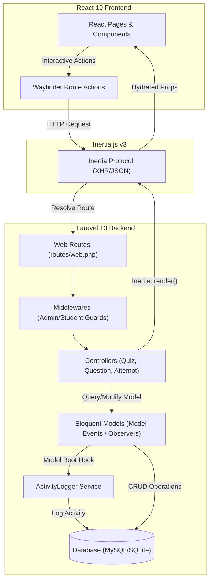

# Laract Quiz - Laravel & React Quiz Application

Laract Quiz is an interactive online quiz application built using **Laravel 13**, **React 19**, **Inertia.js v3**, and **Tailwind CSS v4**. This application supports two main user roles: **Admin** (to manage quizzes and the question bank) and **Student** (to attempt quizzes with an active countdown timer).

## Preview

https://github.com/user-attachments/assets/e3cf10a5-d2b5-4900-a450-864c52fe1530


---

## Key Features

- **Authentication & Authorization**: Registration, login, and role-based access control managed via Laravel Fortify.
- **Admin Panel**:
  - CRUD Quizzes (with time limit configuration).
  - CRUD Questions (supports both Multiple Choice and Essay types).
- **Student Workspace**:
  - List of available quizzes.
  - Quiz attempt page featuring a real-time countdown timer.
  - Instant quiz results with correct/incorrect answer breakdowns.
- **Wayfinder Route Integration**: Automatic TypeScript routing functions mapped to Laravel controllers.

---

## Project Architecture & Directory Structure

This project uses a modern **Monolith** architecture powered by **Inertia.js v3**, bridging **Laravel 13** on the backend and **React 19** on the frontend.

### Architecture Flow



### Directory Structure

Below is an overview of the key folders and files that structure this application:

```text
├── app/
│   ├── Http/
│   │   ├── Controllers/       # Controllers handling Quiz, Question, Attempt & Log requests
│   │   └── Middleware/        # Route access control (EnsureIsAdmin, EnsureIsStudent)
│   ├── Models/                # Eloquent models (defines boot hooks for automatic logging)
│   └── Services/              # Core Services (e.g., ActivityLogger)
├── bootstrap/                 # Application bootstrap & route configuration
├── config/                    # Framework configuration files
├── database/
│   ├── migrations/            # DB Migrations (users, quizzes, questions, quiz_attempts, activity_logs)
│   └── seeders/               # Seeders for default admin, student, and demo quizzes
├── resources/
│   └── js/
│       ├── components/        # Shared React UI components (dialogs, custom buttons, etc.)
│       ├── layouts/           # Page wrapper layouts
│       └── pages/             # React views (Quizzes, Questions, Attempts, ActivityLogs)
├── routes/
│   ├── settings.php           # User profile & credentials settings routes
│   └── web.php                # Core application routes
└── vite.config.ts             # Vite configurations + Wayfinder plugin
```

---

## System Requirements

- PHP >= 8.3
- Node.js >= 18.0 & npm / pnpm
- Composer
- MySQL >= 8.0

---

## Installation Steps

1. **Clone the repository and navigate into the project directory**:
   ```bash
   cd laract-quiz
   ```

2. **Copy the environment configuration file**:
   ```bash
   cp .env.example .env
   ```

3. **Configure the Database**:
   - Create a MySQL database named `laract_quiz`.
   - Open your `.env` file and configure the database credentials under `DB_*` settings:
     ```env
     DB_CONNECTION=mysql
     DB_HOST=127.0.0.1
     DB_PORT=3306
     DB_DATABASE=laract_quiz
     DB_USERNAME=your_username
     DB_PASSWORD=your_password
     ```

4. **Run the automatic setup script** (recommended):
   ```bash
   composer run setup
   ```
   *This script automatically installs PHP & Node.js dependencies, generates the application key, runs database migrations, and builds frontend assets.*

5. **Run the database seeder** to populate demo users and sample quizzes:
   ```bash
   php artisan db:seed
   ```

---

## Running the Application

This application uses Laravel Artisan Dev Server and Vite. You can run both development servers concurrently using a single command:

```bash
composer run dev
```

Open your browser and navigate to:
- **URL**: [http://localhost:8000](http://localhost:8000)

---

## Running with Docker

The application includes a production-ready Docker setup using a multi-stage build (Node.js builds frontend assets, PHP 8.3-FPM + Nginx serves the app).

### Prerequisites

- [Docker](https://docs.docker.com/get-docker/) >= 24
- [Docker Compose](https://docs.docker.com/compose/) >= 2

### Quick Start

1. **Copy the environment file** and configure it:
   ```bash
   cp .env.example .env
   ```

2. **Build and start the containers**:
   ```bash
   docker compose up -d --build
   ```

3. **Run migrations and seed the database** (first run only):
   ```bash
   docker compose exec app php artisan key:generate
   docker compose exec app php artisan migrate --force
   docker compose exec app php artisan db:seed
   ```

4. **Open the app** at [http://localhost:8000](http://localhost:8000)

### Useful Docker Commands

| Command | Description |
|---------|-------------|
| `docker compose up -d --build` | Build image and start containers |
| `docker compose up -d` | Start containers (no rebuild) |
| `docker compose down` | Stop and remove containers |
| `docker compose down -v` | Stop containers and delete volumes (data loss!) |
| `docker compose logs -f app` | Tail application logs |
| `docker compose exec app php artisan <cmd>` | Run Artisan commands |

### Environment Variables

You can override the defaults via `.env` or shell environment:

| Variable | Default | Description |
|----------|---------|-------------|
| `APP_PORT` | `8000` | Host port for the web server |
| `DB_DATABASE` | `laract_quiz` | MySQL database name |
| `DB_USERNAME` | `laract` | MySQL user |
| `DB_PASSWORD` | `secret` | MySQL password |
| `DB_ROOT_PASSWORD` | `root_secret` | MySQL root password |
| `DB_EXPOSE_PORT` | `3307` | Host port to expose MySQL |

---

## Demo Accounts (Seeder)

Use the following credentials to test the application after running the database seeder (`php artisan db:seed`):

### 1. Admin Account (Access Quiz & Question Management)
- **Email**: `admin@laract.com`
- **Password**: `password`

### 2. Student Account (Access Quiz Workspace)
- **Email**: `student@laract.com`
- **Password**: `password`
